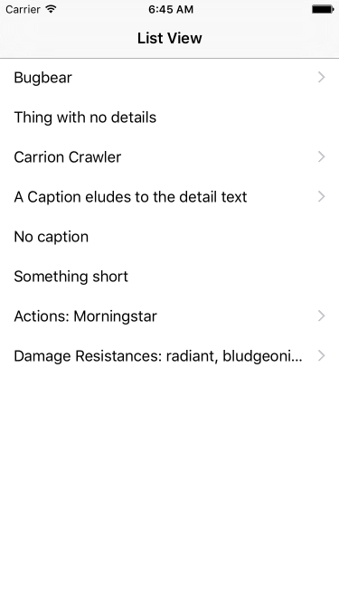

# Shows-Accessories-when-needed

This is a test example showing how to display tableview cells that show a disclosure indicator when more information is 
available and otherwise display not disclosure indicator. The project is built in Xcode and Swift. 

The system uses an array of structs containing two properties the second of which is optional. When the optional property is
*not* nil the disculosure indicator is add using the cell's accessoryType property. Cells that will not reveal more 
infromation should also *be* selectable so the selectionStyle is set to allow this. 

